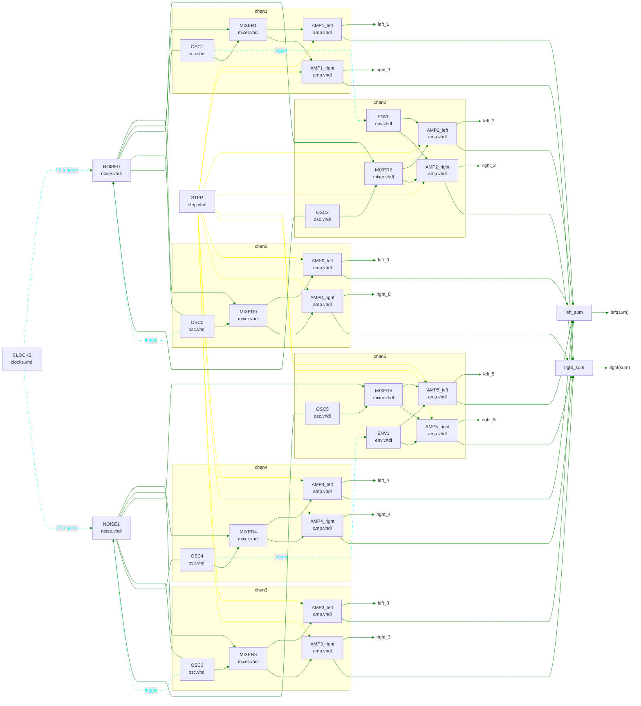

```mermaid
---
  config:
    flowchart:
      curve: monotoneX
---

  graph LR;
      STEP["`STEP
      step.vhdl`"]

      CLOCKS["`CLOCKS
      clocks.vhdl`"]

      OSC0["`OSC0
      osc.vhdl`"]
      OSC1["`OSC1
      osc.vhdl`"]
      OSC2["`OSC2
      osc.vhdl`"]
      OSC3["`OSC3
      osc.vhdl`"]
      OSC4["`OSC4
      osc.vhdl`"]
      OSC5["`OSC5
      osc.vhdl`"]

      NOISE0["`NOISE0
      noise.vhdl`"]
      NOISE1["`NOISE1
      noise.vhdl`"]

      MIXER0["`MIXER0
      mixer.vhdl`"]
      MIXER1["`MIXER1
      mixer.vhdl`"]
      MIXER2["`MIXER2
      mixer.vhdl`"]
      MIXER3["`MIXER3
      mixer.vhdl`"]
      MIXER4["`MIXER4
      mixer.vhdl`"]
      MIXER5["`MIXER5
      mixer.vhdl`"]

      AMP0l["`AMP0_left
      amp.vhdl`"]
      AMP1l["`AMP1_left
      amp.vhdl`"]
      AMP2l["`AMP2_left
      amp.vhdl`"]
      AMP3l["`AMP3_left
      amp.vhdl`"]
      AMP4l["`AMP4_left
      amp.vhdl`"]
      AMP5l["`AMP5_left
      amp.vhdl`"]

      AMP0r["`AMP0_right
      amp.vhdl`"]
      AMP1r["`AMP1_right
      amp.vhdl`"]
      AMP2r["`AMP2_right
      amp.vhdl`"]
      AMP3r["`AMP3_right
      amp.vhdl`"]
      AMP4r["`AMP4_right
      amp.vhdl`"]
      AMP5r["`AMP5_right
      amp.vhdl`"]

      ENV0["`ENV0
      env.vhdl`"]
      ENV1["`ENV1
      env.vhdl`"]

      OSC0-- trigger --->NOISE0;
      OSC3-- trigger --->NOISE1;

      OSC1-- trigger ---->ENV0;
      OSC4-- trigger ---->ENV1;

      CLOCKS-- / 3 triggers --->NOISE0;
      CLOCKS-- / 3 triggers --->NOISE1;

      STEP--->AMP0l;
      STEP--->AMP0r;
      STEP--->AMP1l;
      STEP--->AMP1r;
      STEP--->AMP2l;
      STEP--->AMP2r;
      STEP--->AMP3l;
      STEP--->AMP3r;
      STEP--->AMP4l;
      STEP--->AMP4r;
      STEP--->AMP5l;
      STEP--->AMP5r;

      NOISE0---->MIXER0;
      NOISE0---->MIXER1;
      NOISE0---->MIXER2;

      NOISE1---->MIXER3;
      NOISE1---->MIXER4;
      NOISE1---->MIXER5;

      subgraph chan0
      OSC0-->MIXER0;
      MIXER0-->AMP0l;
      MIXER0-->AMP0r;
      end
      subgraph chan1
      OSC1-->MIXER1;
      MIXER1-->AMP1l;
      MIXER1-->AMP1r;
      end
      subgraph chan2
      OSC2-->MIXER2;
      MIXER2-->AMP2l;
      MIXER2-->AMP2r;
      ENV0-->AMP2l;
      ENV0-->AMP2r;
      %% AMP2r-->ENV0;
      %% AMP2l-->ENV0;
      end
      subgraph chan3
      OSC3-->MIXER3;
      MIXER3-->AMP3l;
      MIXER3-->AMP3r;
      end
      subgraph chan4
      OSC4-->MIXER4;
      MIXER4-->AMP4l;
      MIXER4-->AMP4r;
      end
      subgraph chan5
      OSC5-->MIXER5;
      MIXER5-->AMP5l;
      MIXER5-->AMP5r;
      ENV1-->AMP5l;
      ENV1-->AMP5r;
      %% AMP5l-->ENV1;
      %% AMP5r-->ENV1;
      end

      %% for layout, keep NOISE0 close to OSC0/1/2 and MIXER0/1/2, and NOISE1 close to OSC3/4/5 and MIXER3/4/5
      NOISE0 ~~~ OSC0
      NOISE0 ~~~ OSC1
      NOISE0 ~~~ OSC2
      NOISE1 ~~~ OSC3
      NOISE1 ~~~ OSC4
      NOISE1 ~~~ OSC5

      left_sum
      right_sum

      AMP0l-->left_0@{shape: text}
      AMP1l-->left_1@{shape: text}
      AMP2l-->left_2@{shape: text}
      %% ENV0-- left ---env0l_node[.]@{shape: text}
      %% env0l_node-->left_2@{shape: text}
      AMP3l-->left_3@{shape: text}
      AMP4l-->left_4@{shape: text}
      AMP5l-->left_5@{shape: text}
      %% ENV1-- left ---env1l_node[.]@{shape: text}
      %% env1l_node-->left_5@{shape: text}

      AMP0r-->right_0@{shape: text}
      AMP1r-->right_1@{shape: text}
      AMP2r-->right_2@{shape: text}
      %% ENV0-- right ---env0r_node[.]@{shape: text}
      %% env0r_node-->right_2@{shape: text}
      AMP3r-->right_3@{shape: text}
      AMP4r-->right_4@{shape: text}
      AMP5r-->right_5@{shape: text}
      %% ENV1-- right ---env1r_node[.]@{shape: text}
      %% env1r_node-->right_5@{shape: text}

      AMP0l------>left_sum
      AMP1l------>left_sum
      AMP2l------>left_sum
      %% env0l_node------>left_sum
      AMP3l------>left_sum
      AMP4l------>left_sum
      AMP5l------>left_sum
      %% env1l_node------>left_sum

      AMP0r------>right_sum
      AMP1r------>right_sum
      AMP2r------>right_sum
      %% env0r_node------>right_sum
      AMP3r------>right_sum
      AMP4r------>right_sum
      AMP5r------>right_sum
      %% env1r_node------>right_sum

      left_sum-->leftsumout["`left(sum)`"]@{shape: text}
      right_sum-->rightsumout["`right(sum)`"]@{shape: text}

      linkStyle default stroke:green,stroke-width:1px;
      linkStyle 0,1,2,3,4,5 stroke:cyan,stroke-width:1px,color:cyan,stroke-dasharray:9,5;
      linkStyle 6,7,8,9,10,11,12,13,14,15,16,17 stroke:yellow,stroke-width:1px;
```
